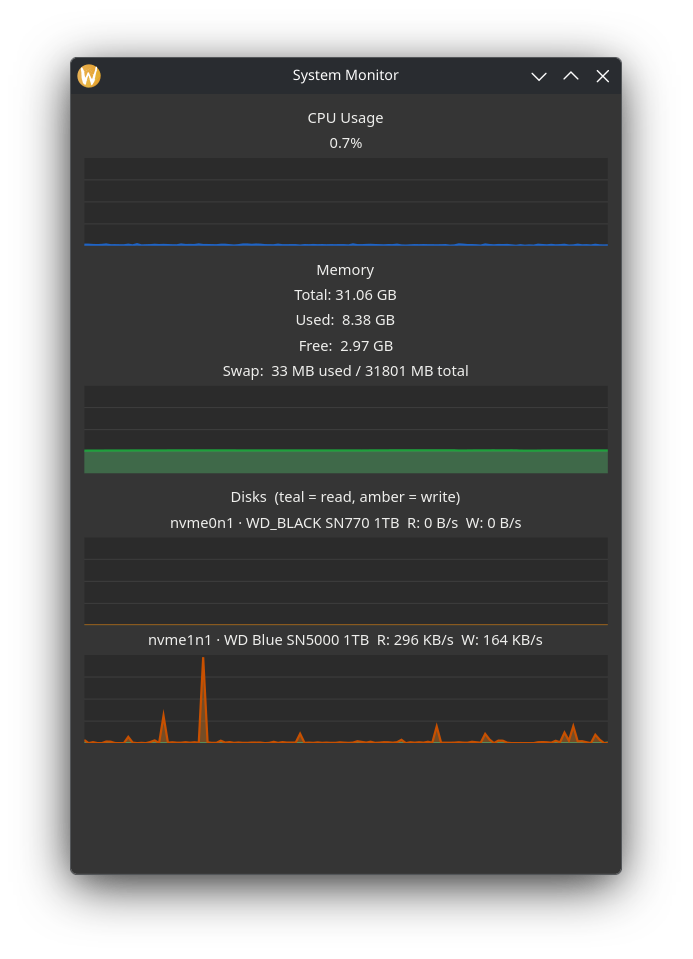

# sysmon

A lightweight system monitor for Linux, written in Rust with a GTK4 UI.



## What it monitors

- **CPU** — usage percentage with a scrolling history graph
- **Memory** — total, used, free, and swap with a scrolling history graph
- **Disks** — real-time read/write throughput per physical drive, with model names pulled from the kernel (e.g. `nvme0n1 · WD_BLACK SN770 1TB`)

All graphs show 120 seconds of history and auto-scale to the data.

## About this project

This is an intentional experiment in using AI coding assistants — specifically [Claude](https://claude.ai) — to develop a non-trivial program in a language I have only basic knowledge of. The goal was to explore how far an AI agent can carry a real project: architecture decisions, GTK4/Cairo rendering, Linux kernel interfaces (`/proc/diskstats`, `/sys/block`), and bug fixes, with a human providing direction and feedback.

The result is a functional, reasonably well-structured Rust application. The experiment is ongoing.

Inspired by [Mission Center](https://missioncenter.io/).

## Building

```sh
cargo build --release
./target/release/system-monitor
```

Requires GTK4 development libraries (`gtk4` / `libgtk-4-dev`).

## Planned

- GPU monitoring
- Network throughput graphs
- Per-core CPU breakdown
